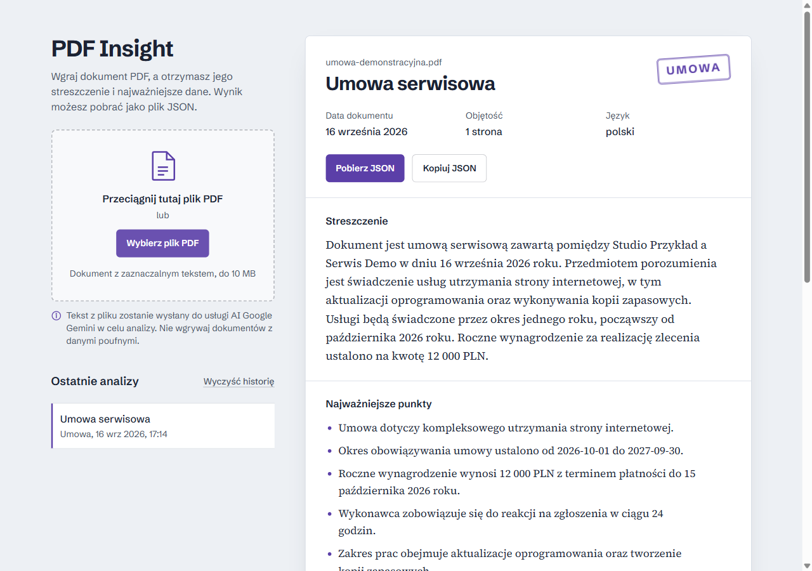

# PDF Insight

Analiza dokumentów PDF: wgraj plik, otrzymaj streszczenie i uporządkowane dane, pobierz JSON.
Interfejs jest po polsku, a streszczenie i wyodrębnione informacje powstają w języku dokumentu.

## Demo

- **[Otwórz aplikację](https://adam903pl.github.io/pdf-insight/)**
- [Publiczne repozytorium](https://github.com/Adam903PL/pdf-insight)
- [Stan API](https://server-production-93b3.up.railway.app/health)
- [Wdrożenia GitHub Pages](https://github.com/Adam903PL/pdf-insight/actions)



Zrzut przedstawia rzeczywisty wynik publicznego demo dla dokumentu z fikcyjnymi danymi.

## Jak używać

1. Przeciągnij jeden PDF do pola wgrywania albo wybierz plik przyciskiem. Limit: 10 MB.
2. Poczekaj na odczyt tekstu i analizę AI.
3. Przeczytaj streszczenie, punkty, organizacje, osoby, kwoty i daty.
4. Użyj „Pobierz JSON”, „Kopiuj JSON” lub rozwiń „Podgląd JSON”.

Ostatnich 10 analiz pozostaje w tej przeglądarce. Można otworzyć je ponownie bez wywołania AI
lub usunąć przyciskiem „Wyczyść historię”. Dokument musi mieć warstwę tekstową; skany nie są obsługiwane.

## Architektura i decyzje

```text
PDF → pdf.js w przeglądarce → tekst + nazwa pliku + liczba stron
    → POST /api/analyze na Railway → walidacja żądania (Zod)
    → Google Gemini → walidacja JSON i schematu (Zod)
    → walidacja we frontendzie → widok wyników / eksport / localStorage
```

- **PDF pozostaje w przeglądarce.** Wyodrębniony tekst, nazwa pliku i liczba stron trafiają do
  backendu; tekst jest przekazywany do Google Gemini. Informacja o tym jest widoczna przed uploadem.
- **Dwa niezależne pakiety npm:** `web/` i `server/`, bez pakietu głównego i workspaces.
- **GitHub Pages hostuje frontend**, a **Railway backend**. Klucz Gemini jest wyłącznie po stronie serwera.
- Stan interfejsu obsługuje `useReducer`: pusty → odczyt → analiza → wynik lub błąd.
  Jednoekranowa aplikacja nie wymaga routera.
- pdf.js ładuje się dopiero po wyborze pliku. Worker jest importowany przez `?url`, dzięki czemu
  działa pod ścieżką `/pdf-insight/` na GitHub Pages.
- Schemat wyniku jest celowo skopiowany do `web/src/lib/schema.ts` i `server/src/schema.ts`.
  Zmiany kontraktu wymagają aktualizacji obu kopii. Część walidująca żądanie istnieje tylko na serwerze.
- Gemini dostaje schemat odpowiedzi i instrukcję traktowania treści jako danych. Niepoprawna składnia
  JSON lub niezgodność ze schematem uruchamia **jedną próbę korekty**. Kolejny błąd daje HTTP 502.
  Obie próby mają wspólny budżet 25 sekund; frontend przerywa oczekiwanie po 35 sekundach.
- Brak bazy danych: historia zawiera wyniki, a nie pliki PDF, i jest przechowywana w `localStorage`.

```text
web/src/components/   formularz wgrywania, stany UI, wynik i historia
web/src/lib/          ekstrakcja PDF, schemat, historia, formatowanie i eksport
web/src/api/          klient API i obsługa błędów
server/src/           endpointy Hono, Gemini, schemat, CORS i limit zapytań
server/test/          testy integracji klienta Gemini z podstawionym transportem HTTP
```

## Stack

- React 18, TypeScript strict, Vite, Tailwind CSS.
- pdf.js (`pdfjs-dist`) do lokalnego odczytu dokumentu.
- Hono na Node.js, SDK `@google/genai`, model `gemini-3-flash-preview`.
- Zod do walidacji na obu granicach; Vitest we frontendzie i `node:test` w backendzie.
- ESLint i Prettier w obu pakietach; GitHub Actions do wdrażania frontendu.

## Uruchomienie lokalne

Wymagane: Git, npm i Node.js. Dla obu pakietów najprościej użyć **Node.js 24**.
Minimalne wersje: frontend 22.13, backend 20.19.

```sh
git clone https://github.com/Adam903PL/pdf-insight.git
cd pdf-insight
```

W pierwszym terminalu:

```sh
cd server
npm ci
```

Skopiuj `server/.env.example` do `server/.env` i ustaw:

```dotenv
GEMINI_API_KEY=twoj_klucz_z_Google_AI_Studio
ALLOWED_ORIGIN=http://localhost:5173
PORT=3000
```

W tym samym terminalu uruchom `npm run dev`. Backend udostępnia
`http://localhost:3000/health` oraz `POST http://localhost:3000/api/analyze`.

W drugim terminalu, zaczynając w katalogu repozytorium:

```sh
cd web
npm ci
```

Skopiuj `web/.env.example` do `web/.env` i ustaw:

```dotenv
VITE_API_URL=http://localhost:3000
```

Uruchom `npm run dev` i otwórz `http://localhost:5173/pdf-insight/`.
Jeśli port jest zajęty, zwolnij go albo uzgodnij porty z `ALLOWED_ORIGIN` i `VITE_API_URL`.
Adres origin nie zawiera `/pdf-insight/` ani końcowego ukośnika.

Nie uruchamiaj poleceń npm w katalogu głównym — nie ma tam `package.json`.

## Zmienne środowiskowe

| Miejsce                             | Zmienna          | Znaczenie                                                                          |
| ----------------------------------- | ---------------- | ---------------------------------------------------------------------------------- |
| `server/.env` / Railway             | `GEMINI_API_KEY` | Sekret z Google AI Studio; nigdy nie trafia do `web/`                              |
| `server/.env` / Railway             | `ALLOWED_ORIGIN` | Jeden origin; lokalnie `http://localhost:5173`, demo `https://adam903pl.github.io` |
| `server/.env` / Railway             | `PORT`           | Lokalnie domyślnie 3000; Railway dostarcza port procesu                            |
| `web/.env` / zmienna GitHub Actions | `VITE_API_URL`   | Publiczny adres backendu, wstawiany podczas kompilacji                             |

Po zmianie `VITE_API_URL` trzeba ponownie zbudować frontend. Brak klucza Gemini albo brak lub
niepoprawna wartość `ALLOWED_ORIGIN` zatrzymuje start backendu z komunikatem diagnostycznym.

## Wdrożenie

**Frontend:** workflow `.github/workflows/deploy.yml` uruchamia lint, sprawdzenie formatowania,
typów i testy, następnie build i publikację GitHub Pages przy pushu na `main`.
W ustawieniach Pages wybierz GitHub Actions. W zmiennych repozytorium Actions ustaw:

```dotenv
VITE_API_URL=https://server-production-93b3.up.railway.app
```

To publiczna zmienna, nie sekret. Przy zmianie nazwy repozytorium zmień też `base` w
`web/vite.config.ts` (obecnie `/pdf-insight/`).

**Backend:** Railway korzysta z gałęzi `main` tego repozytorium, katalogu głównego usługi `server`
i healthchecka `/health`. Build: `npm run build`, start: `npm start`. Ustaw `GEMINI_API_KEY`
oraz `ALLOWED_ORIGIN=https://adam903pl.github.io`. Backend jest sprawdzany lokalnie przed wysłaniem;
nie ma osobnego CI dla `server/`.

Demo powinno pozostać dostępne co najmniej 14 dni od oddania. Wymaga to utrzymania aktywnej usługi
Railway oraz działającego klucza i dostępnej kwoty zapytań Gemini.

## Bezpieczeństwo

- Pliki `.env` są ignorowane przez Git; repozytorium zawiera tylko `.env.example`.
- Klucz Gemini nie trafia do przeglądarki. Nie dodawaj sekretów z prefiksem `VITE_`.
- CORS na `/api/*` jest ograniczony do jednego originu. `/health` celowo nie ma nagłówka CORS.
- Serwer ogranicza żądania do 10 na 10 minut na IP, w ruchomym oknie. Magazyn limitu jest
  ograniczony do 10 tys. klientów. Identyfikacja IP uwzględnia zachowanie proxy Railway.
- Frontend odrzuca pliki ponad 10 MB. Obie strony ograniczają tekst do 200 tys. znaków,
  a backend ogranicza również rozmiar całego body przed odczytem JSON.
- Odpowiedź AI jest niezaufana i walidowana po stronie serwera oraz klienta. Nazwa pliku i liczba
  stron są nadpisywane metadanymi żądania. React renderuje tekst bez `dangerouslySetInnerHTML`.
- Instrukcje w dokumentach nie są poleceniami dla modelu. Instrukcja systemowa i znaczniki dokumentu
  ograniczają prompt injection, ale nie gwarantują odporności na każdą próbę.
- Logi zawierają metadane (m.in. nazwę pliku, liczbę znaków, czas i status), bez zamierzonego
  zapisywania treści PDF lub klucza. Nie wgrywaj dokumentów poufnych ani z wrażliwymi nazwami plików.
- API jest publiczne i bez logowania. CORS nie zastępuje uwierzytelniania, a limit IP nie jest
  limitem całkowitych kosztów dostawcy. Kwoty API trzeba kontrolować u dostawcy.

## Testy

W `web/`:

```sh
npm run lint
npm run format:check
npm run typecheck
npm test
npm run build
```

W `server/`:

```sh
npm run lint
npm run format:check
npm run typecheck
npm test
```

`npm test` backendu najpierw buduje kod. Testy podstawiają transport HTTP i nie wymagają klucza ani
połączenia z Gemini. Sprawdzają pierwszą poprawną odpowiedź, korektę błędnego JSON i schematu,
wyczerpanie jednej próby, zaufane metadane, błąd dostawcy i wspólny budżet czasu.
Frontend ma testy schematu, API, walidacji plików, ekstrakcji tekstu, reduktora, historii,
formatowania i eksportu. `npm run format` w każdym pakiecie poprawia formatowanie.

Przy sprawdzaniu demo przejdź ścieżkę PDF → wynik → pobranie JSON i otwarcie historii po
odświeżeniu. Sprawdź też skan, błędny format pliku oraz układ przy szerokości 360 px.
Opis pracy z AI i wykonanych kontroli znajduje się w [AI_LOG.md](AI_LOG.md).

## Znane ograniczenia

- Brak OCR i odczytu plików zabezpieczonych hasłem. Dokumenty z mniej niż 50 znakami bez białych
  znaków są traktowane jako pozbawione użytecznej warstwy tekstowej.
- Brak dzielenia długich dokumentów na fragmenty: ponad 200 tys. znaków oznacza komunikat błędu.
- Układ wielokolumnowy i złożone tabele mogą pogorszyć kolejność tekstu odczytanego przez pdf.js.
- AI może błędnie rozpoznać informacje. Zod sprawdza strukturę, nie zgodność każdej wartości
  z dokumentem. Wymóg 3–5 zdań jest przekazany w instrukcji modelu, a nie liczony przez schemat;
  kody języka i waluty są sprawdzane pod kątem formatu, nie pełnego słownika ISO.
- Czas zależy od pliku, urządzenia, sieci i Gemini; aplikacja nie gwarantuje wyniku w 30 sekund
  dla każdego dokumentu. Timeout, brak kwoty API lub awaria dostawcy kończą się komunikatem błędu.
- Historia nie synchronizuje się między urządzeniami. Usunięcie danych witryny usuwa historię;
  zablokowana lub pełna pamięć przeglądarki ogranicza jej działanie.
- Limit IP jest per proces, zeruje się po restarcie i nie jest współdzielony między instancjami.
  Przeniesienie backendu z Railway wymaga ponownej weryfikacji zaufanych nagłówków proxy.
- Model ma identyfikator `preview`; jego dostępność i limity zależą od dostawcy.
